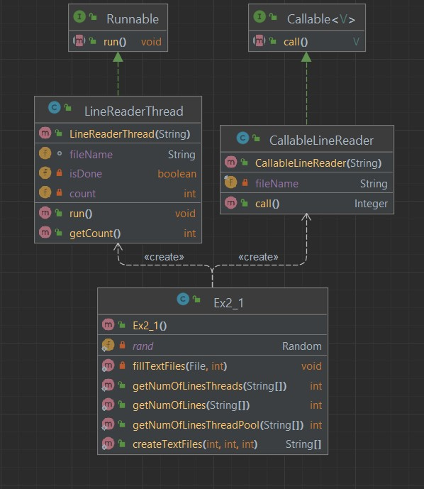

# OOP Assignment 2 part 1
This is the first part of the second assignment.
## Overview 
Our goal was to create three methods that can compute the number of lines in an arbitrary number of files, with arbitrary number of line in each.
 The three method are as such:
1. Compute the lines using a single thread - the main thread.
2. Compute the lines by using a custom class that extends from thread.
3. Compute the lines by using a thread pool with a ThreadPool, and a custom class that implements the Callable interface.
Finally, we would like to see which method works best, and try to understands why one method might work better.

## The Classes
### Ex2_1
This class contians five static functions:

```java 
public static String[] createTextFiles(int n, int seed, int bound){...}'
```
Creates *n* files with at most *bound* lines.  *seed* is used for the creation of random numbers of lines.

```java 
private static void fillTextFiles(File file, int bound){...}
```
This is a private helper functions for the createTextFiles. The functiont generates a random number bounded by *bound* and fills *file* with the generated number of lines.
```java 
public static int getNumOfLines(String[] fileNames){...}
```
Gets an array of file names and sums the number of lines in all the files. This function perfoms the computation in a single thread.
```java 
public static int getNumOfLinesThreads(String[] fileNames){...}
```
Gets an array of file names and sums the number of lines in all the files. This function creates delegates the counting to ```fileNames.length()``` instances of the LineReaderThread class.
```java 
public static int getNumOfLinesThreadPool(String[] fileNames){...}
```
Gets an array of file names and sums the number of lines in all the files. This function delegates the counting to ```fileNames.length()``` instances of the CallableLineReader class.
It uses a fixed ThreadPool of size ```fileNames.length()``` to run all the instances.

### LineReaderThread
This class extends Thread class. It has two class variable: ```String fileName```, ```int count```.

```java
public LineReaderThread(String fileName)
```
The class has one constructor which gets the name of the file to perform the task on.

```java
@Override
 public void run(){...}
```
The function inherited from the Thread class. In our implemention, it counts the number of lines and **updates** the class variable *count*.
```java
public int getCount(){
        return this.count;
    }
```
Returns the number of lines in the file.

### CallableLineReader
This class implements the Callable interface. It has one class variable  ```String fileName```.
```java
public CallableLineReader(String fileName)
```
The class has one constructor which gets the name of the file to perform the task on.
```java
@Override
 public Integer call() throws Exception {...}
```
In our implemention, it counts the number of lines and **returns** the count.

### Class Diagram



## Test Method
Because of the unpredictability of threads, we will test each counting method on the same exact files, and perform the count 50 times. We will keep the times in an array, calculate the average for each method, and compare them.

We will use 10000 text files with 507423417 lines overall.

## Results
#### Method A (Single Thread)
Longest Time: 19.359 sec

Fastest Time: 14.31 sec

Average Time: 14.681 sec

#### Method B (LineReaderThread)
Longest Time: 10.238 sec

Fastest Time: 6.246 sec

Average Time: 8.363 sec

#### Method C (CallableLineReader)
Longest Time: 9.878 sec

Fastest Time: 6.704 sec

Average Time: 8.744 sec

Please note that on different runs, the results vary. The Longest Time of Method B and Method C can go up to even 20 sec. Also, the fastest Average Time of Method b and Method C are too close to call which is faster.

## Conclusions
We'll start with the method that uses one thread. It is by far the slowest method, and for an obvious reason. Method A uses a single thread, mains thread, to count the lines of all 10000 files. In contrast to the two other mehotds, which count the lines of **all** files in parallel, Method A needs to finish with one file to start with another. 

Now lets try to understand why the times of Method B and Method C are so similar.
Method C uses the ExecutorService to create and manage 10000 threads (in our test). From JavaDocs:
> An Executor that provides methods to manage termination and methods that can produce a Future for tracking progress of one or more asynchronous tasks.

The ExecutorService should be used when we want a fixed number of threads to perform a number of tasks **greater** then the thread count. It prevents thread terminition in case there are tasks waiting in it's queue. In our case, the assignment specification calls for a fixed ThreadPool of size ```fileNames.length()```, thus, it nullifies this advandtage of using ExecutorService because no task will be waiting in the queue.

In Method B we create ```fileNames.length()``` instances of our custom class LineReaderThread. Basically, just like in Method C, in Method B we have a designated thread to count the lines for each file.

All in all, this just mean that Method B and Method C. perform in a similiar manner and with similiar results. The main difference of Method B and Method C stems from the strategy to retieve the number of lines of each file.

In Method B we call LineReaderThreads class funtion 
```java
public int getCount(){
        return this.count;
    }
```

In method C we Futures to get the value of the line back from the ExecutorService. In theory, it makes sense that this appoarch will add an overhead that might give Method B an advantage.

But alas, it's too close to call.
