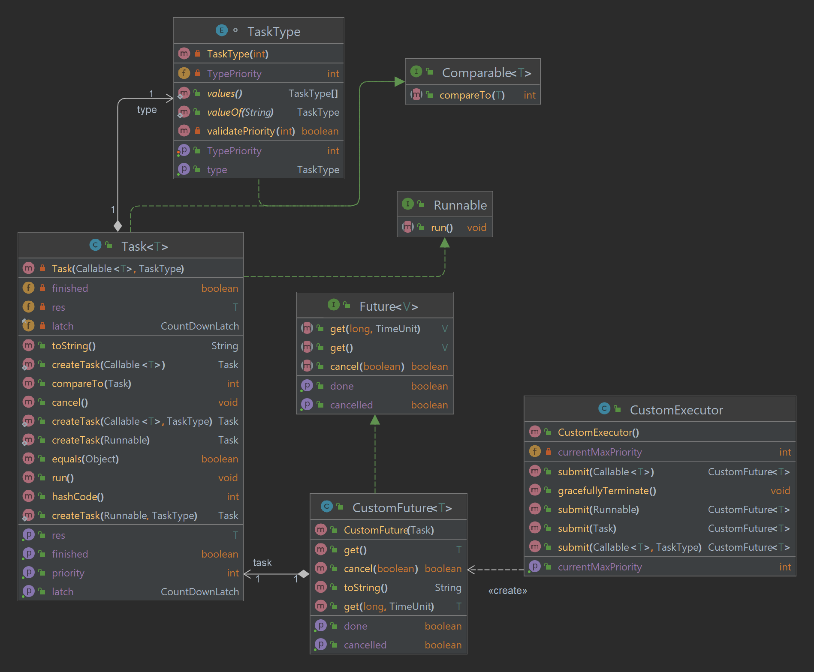

# OOP Assignment 2 part 2
This is the second part of the second assignment.
## Overview 
 Our goal was to create a priority based concurrent execution system. We had to make a Task class that represent a generic task that may return a value of some type, and a CustomExecutor class - An executor that can run the tasks asynchronously, and do so in the order of their priority.

## The Classes
### Task
This class represents to the task performed. The class implements the Runnanle and comparable interfaces. The Runnable interface to allow the execution of the task to be performed by another thread, and the comparable interface to allow the CustomExecutor to compare tasks by their priority. 
The class variables are:
1. ```TaskType type``` - Enum, responsible for the tasks type and priority.
2. ```Callable<V> op``` - The class also wraps a callable instance which actually performs the actual task.
3. ```CountDownLatch latch``` - This latch is shared between a Task instance and it's associated CustomFuture instance. The latch facilitates the ability to time out when the timed ```get``` method is used.
4. ```boolean cancelled``` - Indicates whether the task has been cancelled. Initiated to false.
5. ```boolean finished``` - Indicates whether the task has been performed. Intiated to false.
6. ```T res``` - A generic type the hold the callable operation return value.

The class constructor are private. In order to create a Task instance, the class exposes four factory creation method:
1. Receives a Callable operation and TaskType.
2. Receives only a Callable operation. The method adds a default TaskType of type ```OTHER``` and delegates the creation to the first method.
3. Receives a Runnable operation. The method wraps the Runnable using Executors static method ```callable()```, adds a default TaskType of type ```OTHER```, and delegates the creation to the first method.
4. Same as 3 only it recieves a TaskType as well.

### CustomFuture
This class responsibility is to return the value of the operation performed by Task. The class is a generic class and it implements the Future interfcae.
The class variables are:
1. ```Task task``` - The associated task. The instance is will retrieve the result of this task.
2. ```CountDownLatch latch``` - This latch is shared between a Task instance and it's associated CustomFuture instance. The latch facilitates the ability to time out when the timed ```get``` method is used.
3. ```boolean cancel``` - Indicates whether the user wants to cancel the task.

The class has one constructor the receives a Task instance.

### CustomExecutor
A custom priority based ThreadPoolExecutor. 
The class variables are:
1. ```ThreadPoolExecutor executor``` - Most of the class's responsibility and logic is delegated to this ThreadPoolExecutor instance.
2. ```int currentMaxPriority``` - Holds the highest priority currently in the executors thread pool.
3. ```boolean stopped``` - Indicates whether the executor is shutting down or shut down.
### Class Diagram



## Test Method
Because of the unpredictability of threads, we will test each counting method on the same exact files, and perform the count 50 times. We will keep the times in an array, calculate the average for each method, and compare them.

We will use 10000 text files with 507423417 lines overall.

## Results
#### Method A (Single Thread)
Longest Time: 19.359 sec

Fastest Time: 14.31 sec

Average Time: 14.681 sec

#### Method B (LineReaderThread)
Longest Time: 10.238 sec

Fastest Time: 6.246 sec

Average Time: 8.363 sec

#### Method C (CallableLineReader)
Longest Time: 9.878 sec

Fastest Time: 6.704 sec

Average Time: 8.744 sec

Please note that on different runs, the results vary. The Longest Time of Method B and Method C can go up to even 20 sec. Also, the fastest Average Time of Method b and Method C are too close to call which is faster.

## Conclusions
We'll start with the method that uses one thread. It is by far the slowest method, and for an obvious reason. Method A uses a single thread, mains thread, to count the lines of all 10000 files. In contrast to the two other mehotds, which count the lines of **all** files in parallel, Method A needs to finish with one file to start with another. 

Now lets try to understand why the times of Method B and Method C are so similar.
Method C uses the ExecutorService to create and manage 10000 threads (in our test). From JavaDocs:
> An Executor that provides methods to manage termination and methods that can produce a Future for tracking progress of one or more asynchronous tasks.

The ExecutorService should be used when we want a fixed number of threads to perform a number of tasks **greater** then the thread count. It prevents thread terminition in case there are tasks waiting in it's queue. In our case, the assignment specification calls for a fixed ThreadPool of size ```fileNames.length()```, thus, it nullifies this advandtage of using ExecutorService because no task will be waiting in the queue.

In Method B we create ```fileNames.length()``` instances of our custom class LineReaderThread. Basically, just like in Method C, in Method B we have a designated thread to count the lines for each file.

All in all, this just mean that Method B and Method C. perform in a similiar manner and with similiar results. The main difference of Method B and Method C stems from the strategy to retieve the number of lines of each file.

In Method B we call LineReaderThreads class funtion 
```java
public int getCount(){
        return this.count;
    }
```

In method C we Futures to get the value of the line back from the ExecutorService. In theory, it makes sense that this appoarch will add an overhead that might give Method B an advantage.

But alas, it's too close to call.
